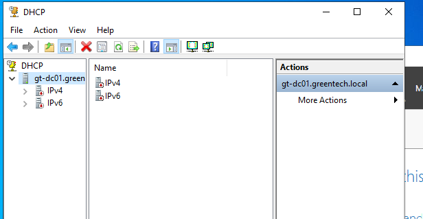
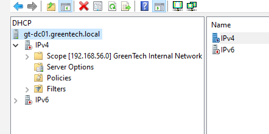
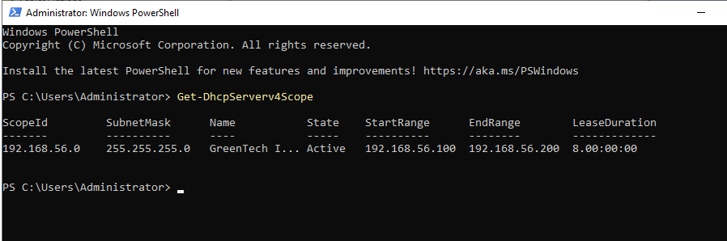

# GreenTech IT Infrastructure Lab

## Project Overview

This project is a hands-on IT infrastructure and cybersecurity lab designed to simulate a small business environment.

The lab includes Windows Server, Active Directory, a domain-joined Windows client, Ubuntu Server, Docker, file shares, firewall hardening, backup scripting, restore testing, and basic monitoring.

The goal of the project is to demonstrate practical junior IT, infrastructure, system administration, and cybersecurity skills in a realistic lab environment.

---

## Lab Environment

| System | Hostname | Role | IP Address |
|---|---|---|---|
| Windows Server | `GT-DC01` | Domain Controller, DNS, DHCP, File Server | `192.168.56.10` |
| Windows Client | `GT-CLIENT01` | Domain-joined workstation | `192.168.56.20` |
| Ubuntu Server | `GT-LINUX01` | Linux server, Docker host, backup host | `192.168.56.30` |
| Docker Container | `greentech-nginx` | Internal web service | Port `8080` |
| Domain | `greentech.local` | Active Directory domain | N/A |

---

## Technologies Used

### Windows Infrastructure

- Windows Server 2022
- Active Directory Domain Services (AD DS)
- DNS
- DHCP
- Group Policy
- Windows File Services
- File Server Resource Manager (FSRM)
- Windows Server Backup

### Linux Services

- Ubuntu Server 24.04 LTS
- Docker
- Nginx
- UFW Firewall

### Administration & Automation

- Windows 10 Client
- PowerShell
- Bash
- Git and GitHub
- VirtualBox

---

## What Was Built

### 1. Windows Server and Active Directory

- Installed and configured `GT-DC01`
- Created the domain `greentech.local`
- Configured Active Directory Domain Services
- Created organizational units for:
  - Users
  - Groups
  - Computers
  - Service Accounts
  - Domain Controllers
- Created test users and security groups
- Joined `GT-CLIENT01` to the domain
- Validated domain login from the Windows client

### 2. File Shares and Permissions

Department file shares were created on `GT-DC01`:

- `\\GT-DC01\HR`
- `\\GT-DC01\Finance`
- `\\GT-DC01\Sales`
- `\\GT-DC01\IT`

Access was controlled using Active Directory security groups and NTFS permissions.

### 3. DHCP Server

- Installed the DHCP Server role
- Created an IPv4 scope for the internal lab network
- Configured address exclusions
- Configured DNS and domain options
- Authorized the DHCP server in Active Directory
- Validated DHCP functionality using PowerShell

### 4. Ubuntu Server

- Installed Ubuntu Server 24.04 LTS as `GT-LINUX01`
- Configured static internal IP address `192.168.56.30`
- Enabled SSH access
- Added NAT networking for updates and Docker image downloads
- Applied basic Linux hardening

### 5. Linux Hardening

Basic Linux security hardening included:

- System updates using `apt`
- SSH validation
- UFW firewall activation
- Default deny incoming firewall policy
- Allowed OpenSSH
- Allowed port `8080/tcp` for the internal web service

### 6. Docker and Nginx

- Installed Docker on `GT-LINUX01`
- Tested Docker using the `hello-world` container
- Deployed an Nginx container named `greentech-nginx`
- Hosted a custom internal web page:
  - `GreenTech Internal IT Portal`
- Exposed the web service on port `8080`

### 7. File Server Resource Manager (FSRM)

- Installed File Server Resource Manager (FSRM)
- Configured storage quotas
- Created file screening rules
- Blocked prohibited file types
- Validated quota and file screening functionality

### 8. Windows Server Backup

- Installed Windows Server Backup
- Added a dedicated backup disk
- Configured scheduled backups
- Performed a successful backup
- Verified backup completion

### 9. Backup and Restore

- Created a Bash backup script for the GreenTech web files
- Stored backups as timestamped `.tar.gz` archives
- Tested restoring from backup
- Verified restored files using `diff`


### 10. Logging and Monitoring

Basic monitoring checks included:

- System uptime
- Disk usage
- Memory usage
- SSH logs
- Docker logs
- Firewall status

---

## Architecture Overview

```text
                           Physical Windows Host
                                      |
                              VirtualBox Lab
                                      |
        --------------------------------------------------------
        |                                                      |
 Internal Network: greentech-lab                         NAT Adapter
        |                                                      |
  ------------------      --------------------      --------------------
  |    GT-DC01      |      |   GT-CLIENT01    |      |   GT-LINUX01     |
  | Windows Server  |      | Windows 10       |      | Ubuntu Server    |
  | 192.168.56.10   |      | 192.168.56.20    |      | 192.168.56.30    |
  | AD DS / DNS     |<---->| Domain Client    |      | Docker Host      |
  | File Shares     |      | Share Testing    |<---->| Nginx / Backup   |
  ------------------      --------------------      --------------------
```

---

## Project Structure

```text
greentech-it-infrastructure-lab/
│
├── active-directory/
├── architecture/
├── backup/
├── backup-logging/
├── docker/
├── final-report/
├── linux/
├── networking/
├── security/
├── storage/
├── screenshots/
│   ├── active-directory/
│   ├── backup/
│   ├── client-tests/
│   ├── dhcp/
│   ├── dns/
│   ├── linux/
│   ├── networking/
│   └── storage/
│
└── README.md
```
```

---

## Key Validation Commands

### Windows / Active Directory

```powershell
whoami
hostname
nltest /dsgetdc:greentech.local
Test-Path "\\GT-DC01\HR"
Test-Path "\\GT-DC01\Finance"
Test-Path "\\GT-DC01\Sales"
Test-Path "\\GT-DC01\IT"
```

### Linux

```bash
hostname
whoami
ip a
ping -c 4 192.168.56.10
sudo ufw status verbose
```

### Docker

```bash
docker --version
docker ps
curl http://localhost:8080
docker logs greentech-nginx
```

### Backup and Restore

```bash
~/scripts/backup-greentech-web.sh
ls -lh ~/backups
tar -tzf ~/backups/*.tar.gz | head
diff ~/greentech-web/index.html ~/restore-test/home/garus/greentech-web/index.html
```

---

## Documentation

Detailed documentation is available in the following folders:

- [Active Directory setup](active-directory/ad-setup.md)
- [Users and groups](active-directory/users-and-groups.md)
- [Group Policy hardening](active-directory/group-policy-hardening.md)
- [Account lockout testing](active-directory/account-lockout-testing.md)
- [GPO mapped drives](active-directory/gpo-mapped-drives.md)
- [Windows security GPO](active-directory/windows-security-gpo.md)
- [File Server Resource Manager](storage/fsrm-file-screening.md)
- [Windows Server Backup](backup/windows-server-backup.md)
- [Shared folder permissions](active-directory/shared-folder-permissions.md)
- [DNS Management](networking/dns-management.md)
- [DHCP Server](networking/dhcp-server.md)
- [Architecture overview](architecture/architecture-overview.md)
- [Ubuntu Server setup](linux/ubuntu-server-setup.md)
- [Linux hardening](linux/linux-hardening.md)
- [Docker notes](docker/docker-compose-notes.md)
- [Backup and logging](backup-logging/backup-plan.md)
- [Security hardening checklist](security/hardening-checklist.md)
- [Incident response plan](security/incident-response-plan.md)
- [CV and LinkedIn summary](final-report/cv-linkedin-summary.md)
- [Final submission summary](final-report/final-submission-summary.md)
---

## Screenshots

Validation screenshots are stored in the `screenshots/` folder.

### Active Directory

The following screenshots show the Active Directory structure, users, and security groups.

[Active Directory OU Structure](screenshots/active-directory/ad-ou-structure.png)

[Active Directory Users](screenshots/active-directory/ad-users.png)

[Active Directory Groups](screenshots/active-directory/ad-groups.png)

### Windows Client and Domain Validation

### DNS

[DNS Manager](screenshots/dns/dns-manager-overview.png)

[DNS Zone Records](screenshots/dns/dns-zone-records.png)

[Client Domain Validation](screenshots/client-tests/client-domain-validation.png)

[Client Shared Folders](screenshots/client-tests/client-shared-folders.png)

[Client Share Access Test](screenshots/client-tests/client-domain-join-share-test.png)

### DHCP







### File Server Resource Manager

[FSRM Installed](screenshots/storage/fsrm-installed.png)

[Quota Created](screenshots/storage/fsrm-quota-created.png)

[File Screening](screenshots/storage/fsrm-file-screen-created.png)

### Windows Server Backup

[Windows Server Backup](screenshots/backup/windows-server-backup-installed.png)

[Backup Running](screenshots/backup/backup-running.png)

[Backup Completed](screenshots/backup/backup-completed.png)

### Linux, Docker, Firewall and Backup

The following screenshots show Linux networking, firewall hardening, Docker validation, Nginx, custom web page, backup, and restore testing.


---

## Skills Demonstrated

This project demonstrates practical experience with:

- Windows Server administration
- Active Directory configuration
- Domain user and group management
- File share permissions
- Windows client domain joining
- Linux server administration
- SSH administration
- Firewall configuration
- Docker container deployment
- Nginx web hosting
- Backup scripting
- Restore testing
- Basic logging and monitoring
- Incident response planning
- Git and GitHub documentation
- DHCP administration
- DNS administration
- Group Policy management
- File Server Resource Manager (FSRM)
- Windows Server Backup
- NTFS permission management

---

## Current Project Status

Completed:

- Windows Server and Active Directory
- Domain-joined Windows client
- Department file shares and permissions
- Ubuntu Server setup
- Linux hardening
- Docker installation
- Nginx internal web service
- Custom internal web page
- Backup script
- Restore validation
- Logging and monitoring checks
- Security hardening checklist
- Incident response plan
- Architecture overview
- Password policy configuration
- Group Policy hardening
- Account lockout testing
- GPO mapped drives
- Windows Security Baseline
- File Server Resource Manager (FSRM)
- Windows Server Backup
- DNS management
- A Record creation
- CNAME alias configuration
- DNS client validation
- DHCP Scope Configuration
- DHCP Authorization
- DHCP Client Validation
- File Server Resource Manager (FSRM)
- Storage Quotas
- File Screening
- Windows Server Backup

Planned future improvements:

- Docker Compose
- Automated backups using cron
- Group Policy Objects
- Password policy configuration
- Centralized logging
- Vulnerability scanning

---

## Summary

The GreenTech IT Infrastructure Lab is a practical portfolio project showing how a small business IT environment can be designed, configured, secured, documented, and validated.

The project combines infrastructure, system administration, cybersecurity basics, Linux, Docker, backup, monitoring, and incident response into one complete lab.
