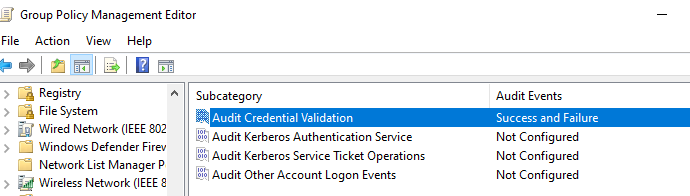
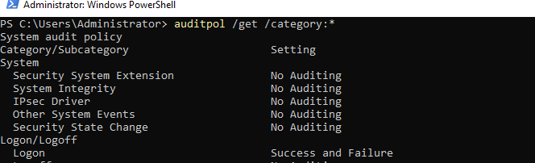
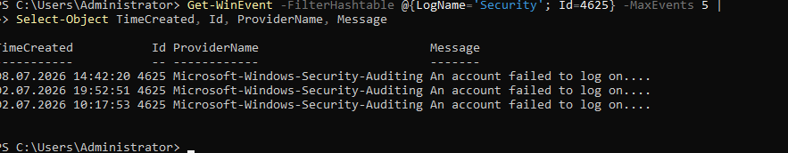

# Windows Auditing and Event Logs

## Overview

This section documents the configuration of Windows Security Auditing using Group Policy.

The objective was to enable auditing for successful and failed logon events and verify that security events were recorded in the Windows Security Event Log.

---

## Audit Policies Configured

The following advanced audit policies were enabled:

- Audit Logon
  - Success
  - Failure

- Audit Credential Validation
  - Success
  - Failure

---

## Group Policy

The auditing policy was configured using:

Computer Configuration

Policies

Windows Settings

Security Settings

Advanced Audit Policy Configuration

Audit Policies

---

## Policy Validation

The configuration was validated using:

```powershell
auditpol /get /category:*
```

The following settings were confirmed:

- Logon → Success and Failure
- Credential Validation → Success and Failure

---

## Security Event Validation

Security events were verified using PowerShell:

```powershell
Get-WinEvent -FilterHashtable @{LogName='Security'; Id=4625} -MaxEvents 5
```

The output confirmed that failed logon attempts were successfully recorded in the Security log.

---

## Screenshots

### Group Policy Configuration



### Audit Policy Validation



### Failed Logon Validation



---

## Skills Demonstrated

- Windows Security Auditing
- Advanced Audit Policy Configuration
- Group Policy Management
- Windows Event Logs
- Event Viewer
- PowerShell log analysis
- Security monitoring