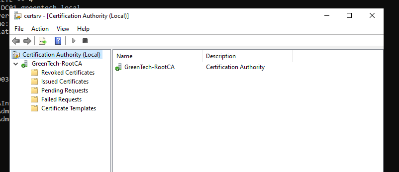
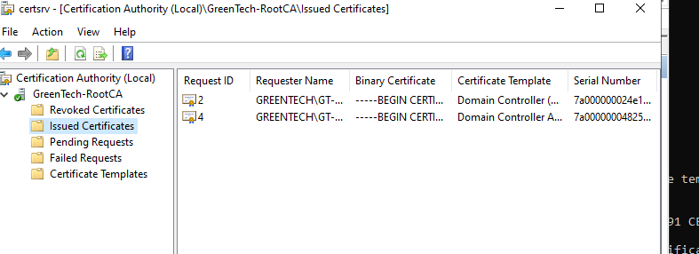

# Active Directory Certificate Services

## Overview

Active Directory Certificate Services was deployed in the GreenTech lab to demonstrate an internal Public Key Infrastructure.

AD CS provides certificate services that can be used for:

- Server authentication
- User and computer authentication
- TLS encryption
- VPN and wireless authentication
- Digital signatures
- Internal trust relationships

The Certification Authority was integrated with the existing Active Directory domain.

## Environment

- Server: `GT-DC01`
- Domain: `greentech.local`
- CA name: `GreenTech-RootCA`
- CA type: Enterprise Root CA
- Cryptographic provider: Microsoft Software Key Storage Provider
- Key algorithm: RSA
- Key length: 2048 bits
- Hash algorithm: SHA-256
- CA validity period: 10 years

---

## Role Installation

The Certification Authority role was installed using PowerShell:

```powershell
Install-WindowsFeature ADCS-Cert-Authority -IncludeManagementTools
```

The installed role was verified using:

```powershell
Get-WindowsFeature ADCS-Cert-Authority
```


---

## Enterprise Root CA Configuration

The server was configured as an Enterprise Root Certification Authority.

```powershell
Install-AdcsCertificationAuthority `
    -CAType EnterpriseRootCA `
    -CACommonName "GreenTech-RootCA" `
    -KeyLength 2048 `
    -HashAlgorithmName SHA256 `
    -CryptoProviderName "RSA#Microsoft Software Key Storage Provider" `
    -ValidityPeriod Years `
    -ValidityPeriodUnits 10 `
    -Force
```

An Enterprise Root CA was selected because the lab server was already joined to and hosting the Active Directory domain.

This configuration allows the CA to use Active Directory certificate templates and domain-based certificate enrollment.

---

## Certification Authority Validation

The AD CS service was verified using:

```powershell
Get-Service CertSvc
```

The service was confirmed as running.

The configured CA name was checked using:

```powershell
certutil -getreg CA\CommonName
```

The result confirmed:

```text
GreenTech-RootCA
```

Further CA information was validated using:

```powershell
certutil -cainfo
```

The output confirmed:

- CA name: `GreenTech-RootCA`
- CA type: Enterprise Root CA
- CA certificate status: Valid
- Certificate Revocation List status: Valid
- DNS name: `GT-DC01.greentech.local`

---

## Certification Authority Console

The Certification Authority management console was opened using:

```powershell
certsrv.msc
```

The console provides access to:

- Revoked Certificates
- Issued Certificates
- Pending Requests
- Failed Requests
- Certificate Templates



---

## Certificate Enrollment

A certificate was requested through the local computer certificate store.

The Certificates MMC snap-in was opened and configured for:

```text
Computer account
Local computer
```

The certificate enrollment process used the Active Directory Enrollment Policy.

A domain controller certificate template was selected and enrolled.

The CA successfully issued a certificate to:

```text
GT-DC01.greentech.local
```

---

## Issued Certificate Validation

The issued certificate was validated in the local machine personal certificate store:

```powershell
Get-ChildItem Cert:\LocalMachine\My |
Select-Object Subject,Issuer,NotAfter
```

The results confirmed a certificate with:

- Subject: `CN=GT-DC01.greentech.local`
- Issuer: `CN=GreenTech-RootCA, DC=greentech, DC=local`
- Valid until: July 2027


---

## Issued Certificates Console

The certificate was also confirmed in the Certification Authority console under:

```text
GreenTech-RootCA
└── Issued Certificates
```



---

## Trusted Root Certificate Validation

The root CA certificate was validated in the Trusted Root Certification Authorities store:

```powershell
Get-ChildItem Cert:\LocalMachine\Root |
Where-Object Subject -Like "*GreenTech-RootCA*" |
Select-Object Subject,Issuer,NotAfter
```

The root certificate was self-signed, meaning that the Subject and Issuer were both:

```text
CN=GreenTech-RootCA, DC=greentech, DC=local
```

The certificate was valid until July 2036.


---

## Troubleshooting

An initial manual PKCS#10 certificate request was submitted without specifying a certificate template.

The Enterprise CA rejected the request with:

```text
CERTSRV_E_NO_CERT_TYPE
The request contains no certificate template information.
```

This occurred because Enterprise Certification Authorities require certificate template information for template-based enrollment.

The certificate was therefore requested through the Certificates MMC snap-in using Active Directory Enrollment Policy and a domain controller certificate template.

This successfully completed the enrollment process.

---

## Security Considerations

A Root Certification Authority is a highly trusted security component.

In a production environment, additional controls should be considered:

- A dedicated offline Root CA
- A separate issuing CA
- Restricted administrative access
- Hardware Security Module protection
- Certificate revocation planning
- Regular CA database backups
- Auditing of certificate issuance
- Shorter certificate validity periods
- Documented certificate policies

For this lab, an Enterprise Root CA was deployed directly on the domain controller to reduce infrastructure requirements.

---

## Skills Demonstrated

- Active Directory Certificate Services
- Public Key Infrastructure
- Enterprise Root CA deployment
- Certificate Authority administration
- Certificate template enrollment
- Computer certificate management
- Root trust validation
- PowerShell administration
- Certutil troubleshooting
- Certificate request troubleshooting
- Windows MMC administration
- Security documentation

---

## Outcome

An Enterprise Root Certification Authority was successfully installed and configured in the GreenTech domain.

The CA service was validated, the Root CA certificate was trusted by the local computer, and a domain controller certificate was successfully issued and installed.

This demonstrated a complete basic internal PKI workflow from CA deployment to certificate enrollment and validation.