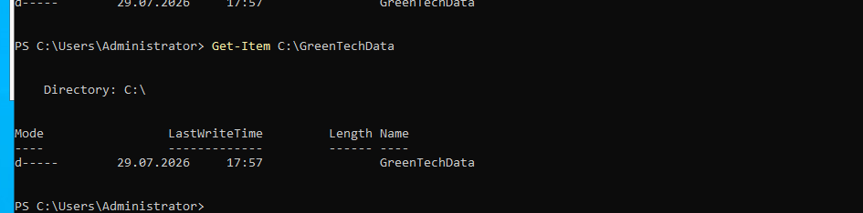
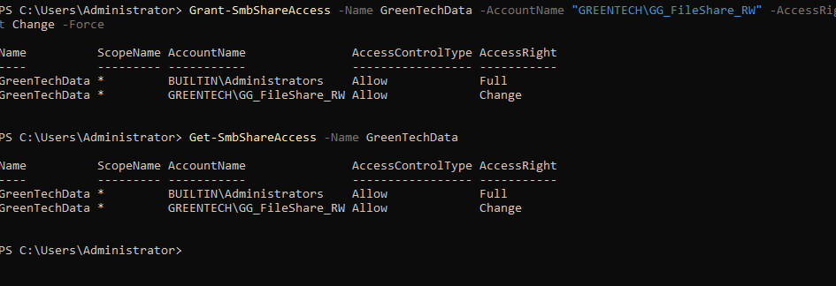
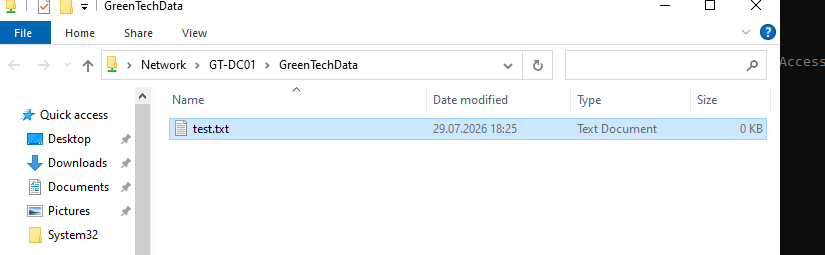

# Windows File Server and SMB Shares

## Overview

This lab demonstrates the deployment and configuration of a Windows file server in an Active Directory domain environment.

A shared folder was created on the GreenTech domain controller and published as an SMB network share. Access was controlled through an Active Directory security group, Share Permissions, and NTFS permissions.

The configuration follows a group-based access model instead of assigning permissions directly to individual users.

---

## Environment

- Server: GT-DC01
- Domain: greentech.local
- Operating system: Windows Server 2022
- File server path: C:\GreenTechData
- SMB share name: GreenTechData
- Network path: \\GT-DC01\GreenTechData
- Security group: GG_FileShare_RW
- Test user: test.user

---

## Objectives

The objectives of this lab were to:

- Verify the Windows File Server role
- Create a central data folder
- Publish the folder as an SMB share
- Create an Active Directory security group
- Add a test user to the security group
- Configure Share Permissions
- Configure NTFS permissions
- Verify read and write access
- Document the implementation

---

## File Server Role

The Windows File Server role was verified using PowerShell:

```powershell
Get-WindowsFeature FS-FileServer
```

If required, the role can be installed using:

```powershell
Install-WindowsFeature FS-FileServer -IncludeManagementTools
```

---

## Creating the Data Folder

A dedicated folder was created for the GreenTech file share:

```powershell
New-Item -ItemType Directory -Path "C:\GreenTechData"
```

The folder was verified using:

```powershell
Get-Item "C:\GreenTechData"
```


---

## Creating the SMB Share

The folder was published as an SMB share using PowerShell:

```powershell
New-SmbShare `
    -Name "GreenTechData" `
    -Path "C:\GreenTechData" `
    -FullAccess "Administrators"
```

The share was verified using:

```powershell
Get-SmbShare
```

The resulting network path was:

```text
\\GT-DC01\GreenTechData
```


---

## Active Directory Security Group

A Global Security Group was created in Active Directory:

```text
GG_FileShare_RW
```

The naming convention indicates:

- GG: Global Group
- FileShare: Resource purpose
- RW: Read and Write access

Using security groups makes access management more scalable than assigning permissions directly to individual users.



---

## Test User

A test domain user was created:

```text
GREENTECH\test.user
```

The user was added to:

```text
GG_FileShare_RW
```

This allows the user to receive file-share permissions through group membership.


---

## Share Permissions

Share Permissions were configured using PowerShell because the graphical management interface became unresponsive in the resource-constrained virtual machine.

The security group was granted Change access:

```powershell
Grant-SmbShareAccess `
    -Name "GreenTechData" `
    -AccountName "GREENTECH\GG_FileShare_RW" `
    -AccessRight Change `
    -Force
```

The configuration was verified using:

```powershell
Get-SmbShareAccess -Name "GreenTechData"
```

The configured permissions included:

| Principal | Share permission |
|---|---|
| GREENTECH\Administrators | Full |
| GREENTECH\GG_FileShare_RW | Change |



---

## NTFS Permissions

NTFS permissions were configured on:

```text
C:\GreenTechData
```

The security group received Modify access, including inheritance for files and subfolders.

The permission can be configured using:

```powershell
icacls "C:\GreenTechData" /grant "GREENTECH\GG_FileShare_RW:(OI)(CI)M"
```

The permissions were verified using:

```powershell
icacls "C:\GreenTechData"
```

The permission flags represent:

- OI: Object inherit
- CI: Container inherit
- M: Modify

Modify access allows users to:

- Read files
- Create files
- Edit files
- Create folders
- Delete files and folders

The group was not granted Full Control.


---

## Permission Model

Access to an SMB share is determined by both:

1. Share Permissions
2. NTFS Permissions

When a user accesses the folder through the network, Windows applies the most restrictive effective combination.

The implemented configuration was:

| Permission layer | Access |
|---|---|
| Share Permissions | Change |
| NTFS Permissions | Modify |

This provides read and write access without granting users Full Control over the folder.

---

## Access Verification

The SMB share was opened using:

```text
\\GT-DC01\GreenTechData
```

A text file named `test.txt` was successfully created and saved inside the shared folder.

The successful file creation confirmed write access to the SMB share.



---

## Security Benefits

The implemented configuration provides several security benefits:

- Permissions are assigned through an Active Directory group
- Individual users do not receive direct folder permissions
- Users receive only the access required for their role
- Full Control is restricted
- NTFS inheritance applies permissions consistently
- Access can be removed by changing group membership
- Centralized data can be managed and protected more easily

---

## Administrative Benefits

This design allows administrators to:

- Add or remove users without editing folder permissions
- Apply consistent access across files and subfolders
- Manage permissions centrally
- Reduce administrative errors
- Scale the configuration to additional users
- Audit access through Active Directory group membership

---

## Troubleshooting

The graphical Share Permissions interface became unresponsive when applying changes.

The issue was worked around by configuring the permissions through PowerShell:

```powershell
Grant-SmbShareAccess
```

PowerShell provided a stable and repeatable method of applying and verifying the SMB permissions.

---

## Skills Demonstrated

- Windows Server administration
- File Server role management
- SMB share configuration
- Active Directory user administration
- Active Directory security groups
- Group-based access control
- Share Permissions
- NTFS permissions
- Permission inheritance
- Least-privilege access
- PowerShell administration
- SMB troubleshooting
- Access verification
- Technical documentation

---

## Outcome

A functional Windows file server share was successfully deployed in the GreenTech Active Directory environment.

The `GreenTechData` folder was published through SMB, protected using an Active Directory security group, and configured with both Share and NTFS permissions.

Read and write access was successfully demonstrated by creating and saving a file through the network share. The lab demonstrates practical experience with centralized file storage and access control in a Windows domain environment.