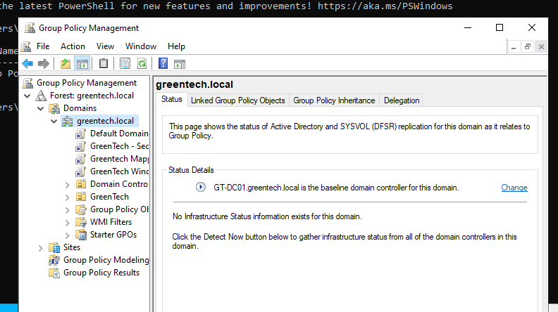
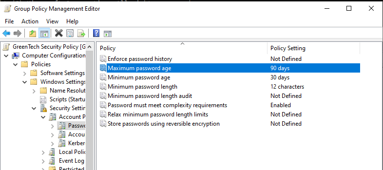
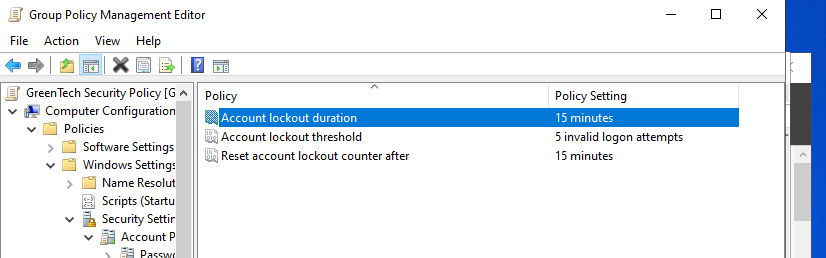
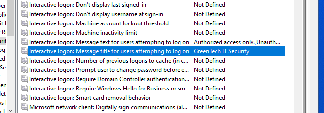
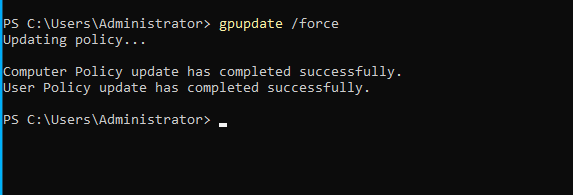
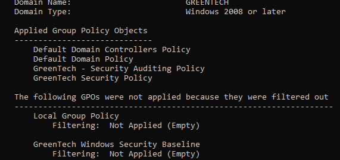

# Group Policy Management

## Overview

Group Policy is one of the most important management technologies in Microsoft Active Directory environments. It enables administrators to centrally configure operating systems, user settings, security policies, software deployment, and administrative restrictions across an entire domain.

In this lab, Group Policy Management was used to create and deploy a custom security policy within the GreenTech Active Directory environment. The policy demonstrates centralized administration and the enforcement of password security, account lockout protection, and interactive logon messages.

---

## Environment

- Server: GT-DC01
- Domain: greentech.local
- Operating System: Windows Server 2022
- Management Tool: Group Policy Management Console (GPMC)

---

## Objectives

The objectives of this lab were to:

- Create a custom Group Policy Object (GPO)
- Link the GPO to the Active Directory domain
- Configure password policies
- Configure account lockout protection
- Configure an interactive security logon message
- Apply the policy to the domain
- Verify policy deployment using PowerShell

---

## Group Policy Management Console

The Group Policy Management Console was opened using:

```powershell
gpmc.msc
```

The Active Directory domain contained the default policies:

- Default Domain Policy
- Default Domain Controllers Policy

A new Group Policy Object was created for the GreenTech environment.



---

## Creating a New Group Policy Object

A new Group Policy Object was created and linked to the domain.

Name:

```text
GreenTech Security Policy
```

The policy was linked directly to:

```text
greentech.local
```

This allows all computers within the domain to receive the configured security settings.


---

## Password Policy Configuration

The following password settings were configured:

| Policy | Value |
|---------|------|
| Minimum password length | 12 characters |
| Password complexity | Enabled |
| Maximum password age | 90 days |

These settings improve password strength and reduce the likelihood of successful brute-force attacks.



---

## Account Lockout Policy

To reduce password guessing attacks, an account lockout policy was configured.

| Policy | Value |
|---------|------|
| Account lockout threshold | 5 invalid logon attempts |
| Account lockout duration | 15 minutes |
| Reset account lockout counter | 15 minutes |

This configuration temporarily locks accounts after repeated failed authentication attempts.



---

## Interactive Logon Message

A security warning was configured for all users attempting to sign in.

Title:

```text
GreenTech IT Security
```

Message:

```text
Authorized access only.
Unauthorized access is prohibited and may be monitored.
```

This type of banner is commonly used in enterprise environments to inform users that system activity may be monitored.



---

## Applying Group Policy

After configuring the Group Policy Object, the settings were immediately applied using:

```powershell
gpupdate /force
```

The command successfully updated both the Computer Policy and the User Policy.



---

## Verifying Applied Policies

Applied Group Policies were verified using:

```powershell
gpresult /r
```

The output confirmed that:

```text
GreenTech Security Policy
```

was successfully applied to the computer.



---

## Security Benefits

The implemented Group Policy provides several important security improvements:

- Stronger passwords
- Password complexity enforcement
- Protection against password guessing
- Temporary account lockout after repeated failures
- Centralized policy management
- Standardized security configuration
- Security awareness through logon banners

---

## Administrative Advantages

Using Group Policy allows administrators to:

- Manage thousands of computers centrally
- Enforce consistent security settings
- Reduce configuration drift
- Simplify compliance
- Deploy security settings automatically
- Eliminate repetitive manual configuration

---

## Skills Demonstrated

- Active Directory administration
- Group Policy Management Console
- Group Policy Object creation
- Domain policy deployment
- Password Policy configuration
- Account Lockout Policy configuration
- Interactive Logon configuration
- PowerShell administration
- gpupdate
- gpresult
- Enterprise security administration
- Windows Server management

---

## Outcome

A custom Group Policy Object named **GreenTech Security Policy** was successfully created, configured, linked to the Active Directory domain, and verified.

The policy strengthened password security, implemented account lockout protection, displayed an enterprise logon warning, and was successfully applied across the domain using Group Policy Management and PowerShell verification tools.

This lab demonstrates practical experience with centralized security management in a Windows Server Active Directory environment.