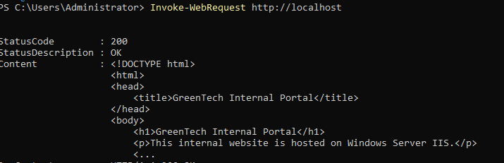
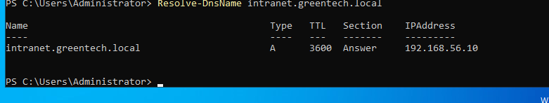
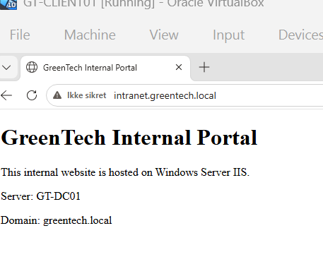

# IIS Internal Web Server

## Overview

This section documents the installation and configuration of Microsoft IIS as an internal web server in the GreenTech IT Infrastructure Lab.

The purpose of this task was to host a simple internal company webpage on the Windows Server and make it accessible through the internal DNS name:

```text
intranet.greentech.local
```

---

## Server Details

| Item | Value |
|---|---|
| Server | GT-DC01 |
| IP Address | 192.168.56.10 |
| Service | Microsoft IIS |
| Website | GreenTech Internal Portal |
| DNS Name | intranet.greentech.local |

---

## IIS Installation

IIS was installed on the Windows Server using PowerShell:

```powershell
Install-WindowsFeature -Name Web-Server -IncludeManagementTools
```

The installation was verified with:

```powershell
Get-WindowsFeature Web-Server
```

---

## Internal Web Page

A custom internal webpage was created in the default IIS web root:

```text
C:\inetpub\wwwroot\index.html
```

The page displays a simple GreenTech internal portal message.

---

## Local Web Server Validation

The website was tested locally on the server using:

```powershell
Invoke-WebRequest http://localhost
```

A successful response confirmed that IIS was running correctly.

Expected result:

```text
StatusCode : 200
```

---

## DNS Configuration

A DNS A record was created for the internal website:

```powershell
Add-DnsServerResourceRecordA `
-Name "intranet" `
-ZoneName "greentech.local" `
-IPv4Address "192.168.56.10"
```

The record maps:

```text
intranet.greentech.local -> 192.168.56.10
```

---

## Client Validation

DNS resolution was tested from the Windows domain client:

```powershell
nslookup intranet.greentech.local
```

Result:

```text
Name:    intranet.greentech.local
Address: 192.168.56.10
```

The website was then opened from the client browser using:

```text
http://intranet.greentech.local
```

This confirmed that the internal IIS website was reachable from a domain-joined workstation.

---

## Screenshots

### IIS Local Validation



### IIS DNS Record Validation



### IIS Client DNS Validation


### IIS Client Webpage Validation



---

## Skills Demonstrated

- IIS installation and configuration
- Windows Server web service administration
- Internal DNS configuration
- DNS A record management
- Client-side name resolution testing
- Internal web application hosting
- Infrastructure documentation