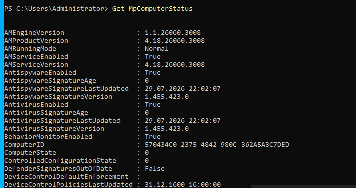
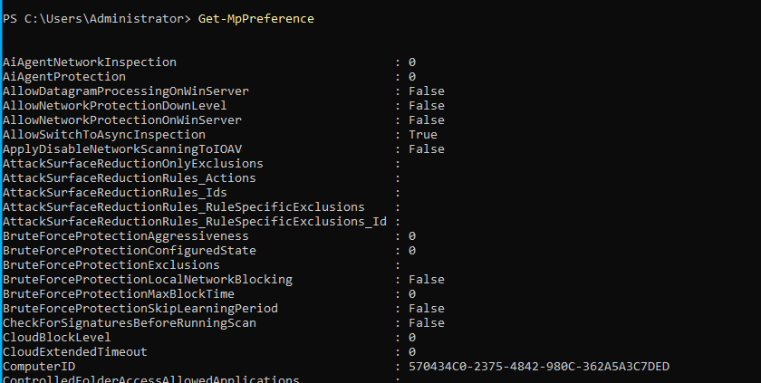
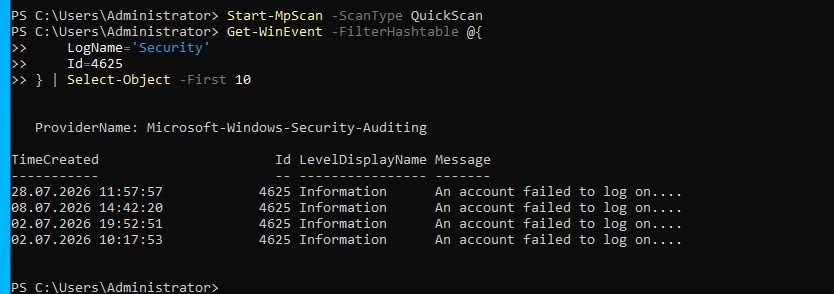
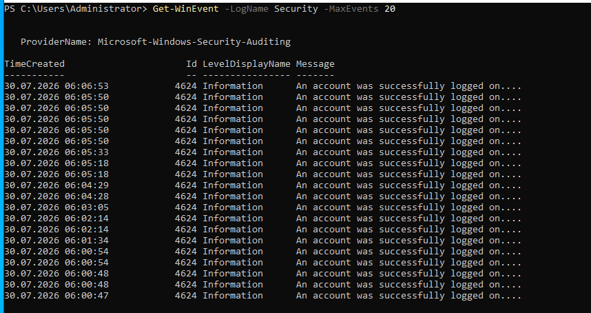
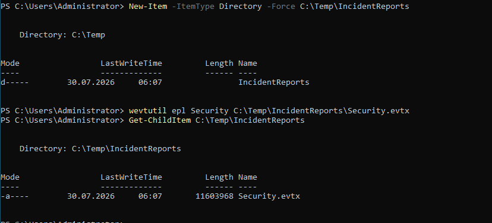
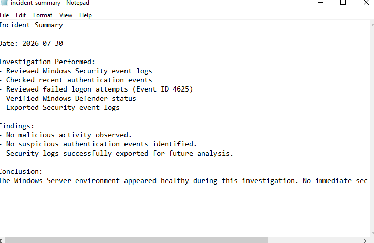

# Windows Defender and Incident Response

## Overview

This lab demonstrates basic incident response procedures on a Windows Server 2022 environment.

The objective was to review Windows Defender status, examine security-related event logs, investigate failed logon attempts, export security logs, and document the investigation.

---

## Environment

- Server: GT-DC01
- Operating System: Windows Server 2022 Standard Evaluation
- Domain: greentech.local

---

## Objectives

- Verify Microsoft Defender status
- Review Defender configuration
- Perform a Quick Scan (if available)
- Review failed logon events
- Review recent security events
- Export Windows Security logs
- Document a basic incident investigation

---

## Microsoft Defender Status

Windows Defender status was reviewed using PowerShell.

```powershell
Get-MpComputerStatus
```

The output confirmed the current antivirus status or documented that Microsoft Defender was unavailable in this server environment.



---

## Microsoft Defender Configuration

The Defender configuration was reviewed using:

```powershell
Get-MpPreference
```

This provides visibility into real-time protection, scheduled scans, exclusions, and other security settings.



---

## Quick Scan

A Quick Scan was initiated where supported.

```powershell
Start-MpScan -ScanType QuickScan
```

If Defender was unavailable, this was documented as part of the lab.


---

## Failed Logon Investigation

Security Event ID **4625** was reviewed to identify failed authentication attempts.

```powershell
Get-WinEvent -FilterHashtable @{
    LogName='Security'
    Id=4625
}
```

Failed logon events are commonly reviewed during incident investigations.



---

## Recent Security Events

Recent security events were reviewed.

```powershell
Get-WinEvent -LogName Security -MaxEvents 20
```

This provides an overview of recent authentication and security activity.



---

## Exporting Security Logs

The Windows Security log was exported using:

```powershell
wevtutil epl Security C:\Temp\IncidentReports\Security.evtx
```

Exporting logs allows further investigation and long-term evidence preservation.



---

## Incident Summary

A basic investigation summary was documented to simulate an incident response report.

The report included:

- Investigation performed
- Findings
- Conclusion



---

## Skills Demonstrated

- Windows Defender Administration
- Security Event Analysis
- Event ID Investigation
- Authentication Monitoring
- Windows Incident Response
- PowerShell Security Administration
- Evidence Collection
- Security Documentation

---

## Outcome

A basic incident response workflow was completed by reviewing Windows Defender, investigating authentication events, exporting Windows Security logs, and documenting the findings.

This demonstrates practical operational security skills used in enterprise Windows environments.