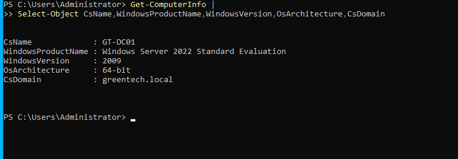
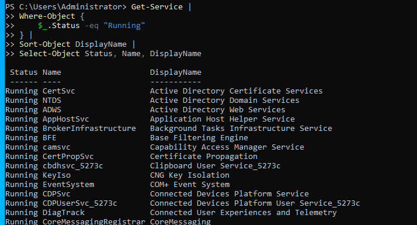
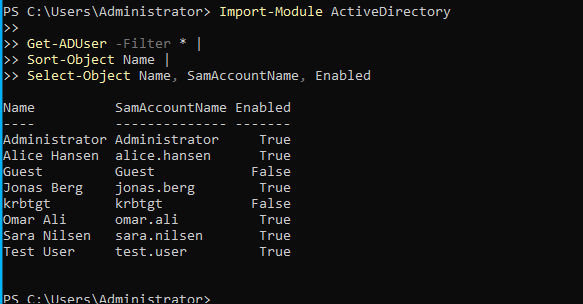
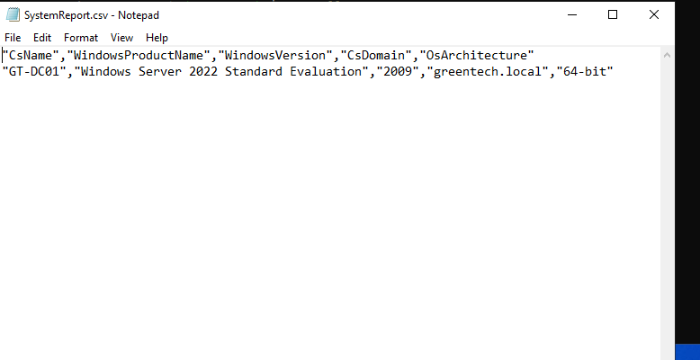
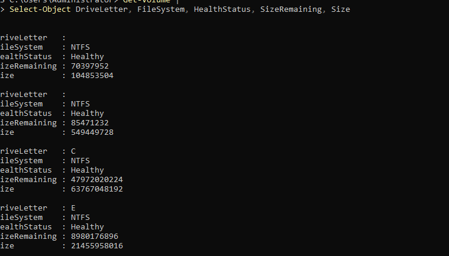
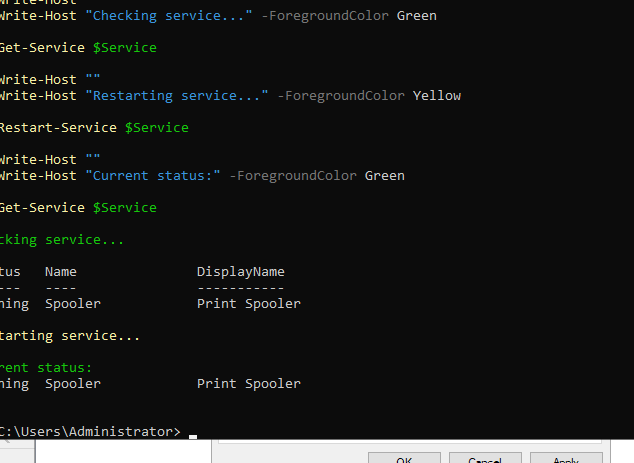

# PowerShell Administration and Automation

## Overview

This lab demonstrates the use of PowerShell for Windows Server administration and automation in the GreenTech Active Directory environment.

Several reusable PowerShell scripts were created to retrieve system information, monitor services, query Active Directory, export reports, inspect disk usage, and restart a Windows service.

The purpose of the lab was to demonstrate how routine administrative tasks can be performed consistently and efficiently through scripting.

---

## Environment

- Server: GT-DC01
- Domain: greentech.local
- Operating system: Windows Server 2022 Standard Evaluation
- PowerShell environment: Windows PowerShell
- Active Directory module: ActiveDirectory
- Script directory: powershell/

---

## Objectives

The objectives of this lab were to:

- Retrieve Windows Server system information
- Query running Windows services
- Retrieve Active Directory users
- Export system information to CSV
- Retrieve disk and volume information
- Restart and verify a Windows service
- Create reusable PowerShell scripts
- Document the scripts and test results

---

## Project Structure

The PowerShell scripts were stored in a dedicated directory:

```text
powershell/
├── Export-SystemReport.ps1
├── Get-ADUsers.ps1
├── Get-DiskUsage.ps1
├── Get-Services.ps1
├── Get-SystemInfo.ps1
└── Restart-ServiceExample.ps1
```

Screenshots were stored in:

```text
screenshots/powershell/
```

---

## System Information Script

The `Get-SystemInfo.ps1` script retrieves important operating system and domain information.

```powershell
Write-Host ""
Write-Host "===== GreenTech System Information =====" -ForegroundColor Green
Write-Host ""

Get-ComputerInfo |
Select-Object `
    CsName,
    WindowsProductName,
    WindowsVersion,
    OsArchitecture,
    CsDomain,
    BiosManufacturer,
    BiosVersion

Write-Host ""
Write-Host "Completed successfully." -ForegroundColor Cyan
```

The output confirmed that the server was:

- Named `GT-DC01`
- Running Windows Server 2022 Standard Evaluation
- Using a 64-bit operating system
- Joined to the `greentech.local` domain



---

## Running Services Script

The `Get-Services.ps1` script retrieves all currently running Windows services.

```powershell
Write-Host ""
Write-Host "===== GreenTech Service Report =====" -ForegroundColor Green
Write-Host ""

Get-Service |
Where-Object {
    $_.Status -eq "Running"
} |
Sort-Object DisplayName |
Select-Object Status, Name, DisplayName

Write-Host ""
Write-Host "Running services displayed successfully." -ForegroundColor Cyan
```

The script filters services by status, sorts them by display name, and presents the most relevant properties.



---

## Active Directory User Report

The `Get-ADUsers.ps1` script uses the Active Directory PowerShell module to retrieve domain users.

```powershell
Write-Host ""
Write-Host "===== GreenTech Active Directory Users =====" -ForegroundColor Green
Write-Host ""

Import-Module ActiveDirectory

Get-ADUser -Filter * |
Sort-Object Name |
Select-Object Name, SamAccountName, Enabled

Write-Host ""
Write-Host "Active Directory users listed successfully." -ForegroundColor Cyan
```

The report included built-in accounts and lab users such as:

```text
Administrator
Guest
krbtgt
test.user
```



---

## System Report Export

The `Export-SystemReport.ps1` script exports selected server information to a CSV file.

```powershell
$ReportPath = "C:\Temp"

if (!(Test-Path $ReportPath)) {
    New-Item -ItemType Directory -Path $ReportPath | Out-Null
}

Get-ComputerInfo |
Select-Object `
    CsName,
    WindowsProductName,
    WindowsVersion,
    CsDomain,
    OsArchitecture |
Export-Csv "$ReportPath\SystemReport.csv" -NoTypeInformation

Write-Host ""
Write-Host "System report exported successfully." -ForegroundColor Green
Write-Host ""
Write-Host "Location: C:\Temp\SystemReport.csv"
```

The script first checks whether the destination folder exists. If the folder is missing, it creates it automatically.

The resulting report was saved as:

```text
C:\Temp\SystemReport.csv
```



---

## Disk Usage Script

The `Get-DiskUsage.ps1` script retrieves volume and storage information.

```powershell
Write-Host ""
Write-Host "===== GreenTech Disk Usage =====" -ForegroundColor Green
Write-Host ""

Get-Volume |
Select-Object `
    DriveLetter,
    FileSystem,
    HealthStatus,
    SizeRemaining,
    Size

Write-Host ""
Write-Host "Disk information retrieved successfully." -ForegroundColor Cyan
```

The script displays:

- Drive letter
- File system
- Volume health
- Remaining storage
- Total volume size



---

## Windows Service Restart

The `Restart-ServiceExample.ps1` script demonstrates controlled service administration.

The Print Spooler service was selected because it was available and running on the lab server.

```powershell
$ServiceName = "Spooler"

Write-Host ""
Write-Host "===== GreenTech Service Restart Example =====" -ForegroundColor Green
Write-Host ""

Write-Host "Service status before restart:" -ForegroundColor Cyan
Get-Service -Name $ServiceName

Write-Host ""
Write-Host "Restarting service..." -ForegroundColor Yellow
Restart-Service -Name $ServiceName -ErrorAction Stop

Write-Host ""
Write-Host "Service status after restart:" -ForegroundColor Cyan
Get-Service -Name $ServiceName

Write-Host ""
Write-Host "Service restarted successfully." -ForegroundColor Green
```

The service was verified before and after the restart.

Critical services such as Active Directory Domain Services, DNS, and DHCP were not restarted.



---

## PowerShell Techniques Demonstrated

The scripts demonstrate several PowerShell techniques:

- Pipelines
- Object filtering
- Object sorting
- Property selection
- Variables
- Conditional statements
- Module imports
- CSV exports
- Service administration
- Active Directory queries
- File and folder validation
- Error handling
- Formatted console output

---

## Administrative Benefits

PowerShell automation provides several benefits:

- Reduces repetitive manual work
- Produces consistent results
- Improves administrative efficiency
- Supports repeatable troubleshooting
- Makes reporting easier
- Reduces the risk of manual configuration errors
- Allows administrative tasks to be documented as code

---

## Security Considerations

The scripts were executed with administrative permissions only when required.

The following precautions were applied:

- Critical Windows services were not restarted
- Active Directory information was queried without modifying accounts
- Reports did not include passwords or sensitive authentication data
- Scripts used explicit service and file paths
- Administrative actions were verified after execution
- The principle of least privilege was considered

---

## Troubleshooting

The scripts were originally created on the host computer inside the GitHub project directory.

Attempting to execute them directly on the virtual server produced a file-not-found error because the files had not been copied to the server.

The commands were therefore tested directly on `GT-DC01`, while the reusable script files remained stored in the GitHub repository.

A CSV file cannot be executed as a PowerShell command. It can instead be opened using:

```powershell
notepad C:\Temp\SystemReport.csv
```

or:

```powershell
Invoke-Item C:\Temp\SystemReport.csv
```

---

## Skills Demonstrated

- Windows PowerShell
- Windows Server administration
- Active Directory administration
- Service management
- System information retrieval
- Storage monitoring
- CSV report generation
- PowerShell pipelines
- PowerShell scripting
- Automation
- Troubleshooting
- Technical documentation

---

## Outcome

A reusable collection of PowerShell administration scripts was successfully created for the GreenTech Windows Server environment.

The scripts demonstrated system inspection, Active Directory queries, service monitoring, storage inspection, report generation, and controlled service administration.

This lab shows how PowerShell can be used to automate common Windows Server tasks and create repeatable administrative workflows.