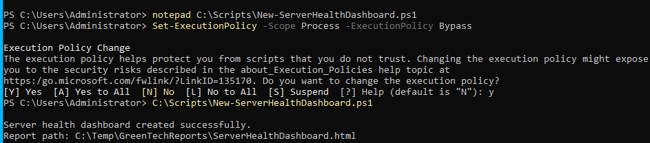
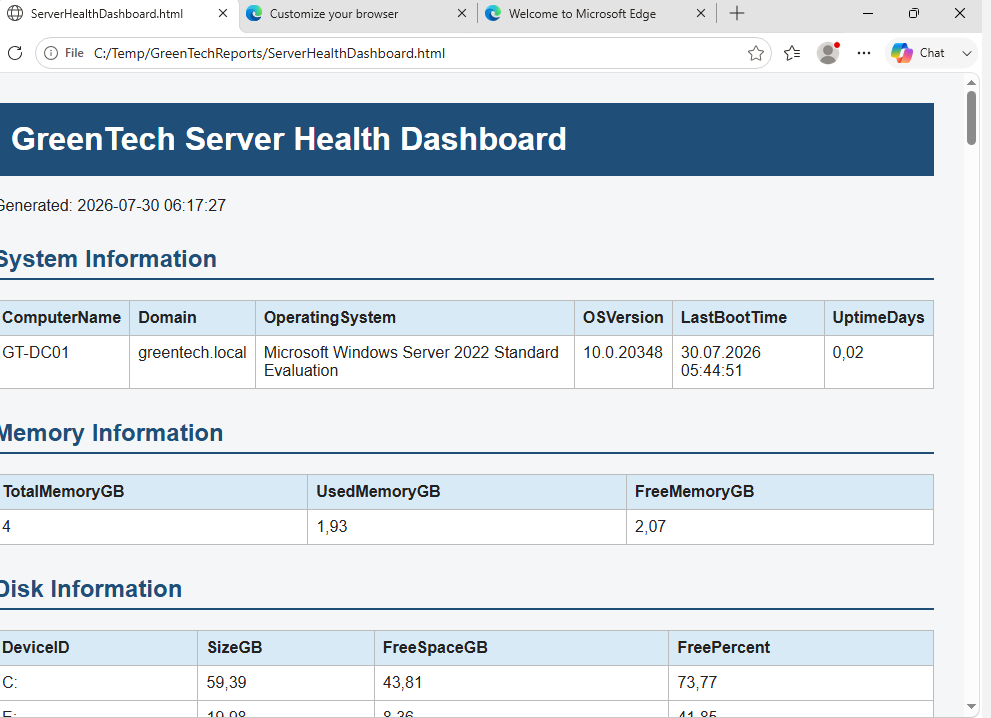
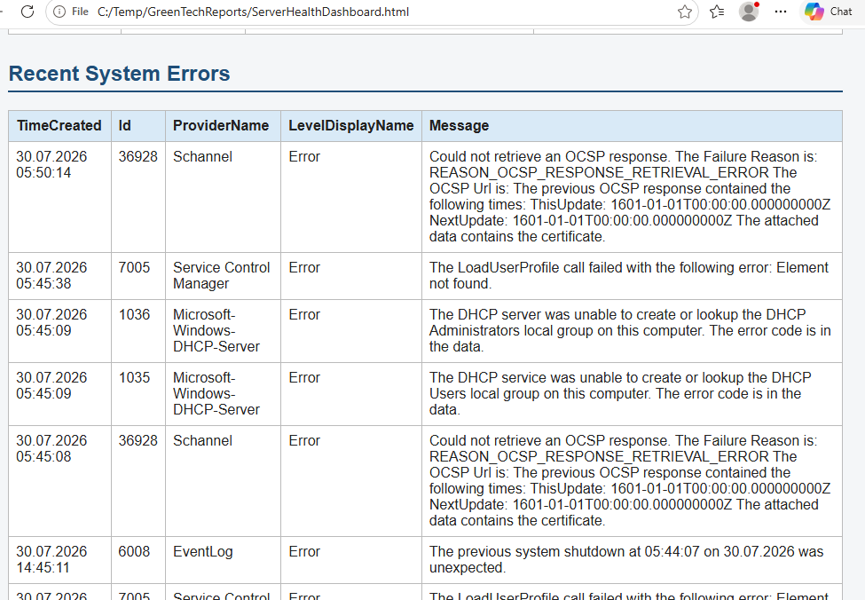
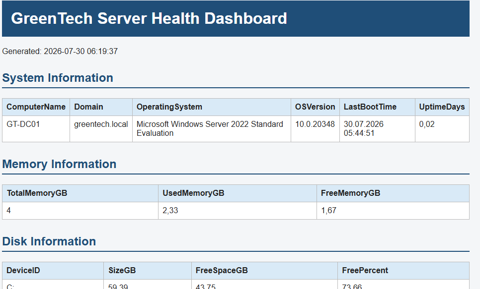

# Server Health Dashboard

## Overview

This lab demonstrates how PowerShell can be used to automate Windows Server health monitoring by generating a consolidated HTML health report.

The dashboard collects key operational information, including system details, memory usage, disk utilization, critical services, firewall profiles, recent event logs, and installed Windows updates.

---

## Environment

- Server: GT-DC01
- Operating System: Windows Server 2022 Standard Evaluation
- Domain: greentech.local
- Tool: Windows PowerShell

---

## Objectives

- Automate Windows Server health monitoring
- Generate an HTML dashboard
- Collect system information
- Monitor critical services
- Review firewall configuration
- Display recent event logs
- Display installed Windows updates

---

## Dashboard Generation

A PowerShell script was developed to automatically generate an HTML health report.

The report is stored in:

```text
C:\Temp\GreenTechReports\ServerHealthDashboard.html
```

The script can be executed whenever an updated server health report is required.



---

## System Information

The dashboard collects:

- Computer name
- Domain
- Operating system
- Windows version
- Last boot time
- Server uptime



---

## Memory and Disk Monitoring

The dashboard reports:

- Total memory
- Used memory
- Free memory
- Logical disks
- Available disk space

This provides a quick overview of server resource usage.

---

## Critical Services

The following services are monitored:

- DNS
- DHCP Server
- Active Directory Domain Services
- Windows Time

Service status is included in the report.

---

## Firewall Status

Firewall profiles are collected using PowerShell.

The dashboard displays:

- Domain Profile
- Private Profile
- Public Profile
- Default inbound rules
- Default outbound rules

---

## Event Monitoring

Recent Windows events are included in the report.

The dashboard retrieves:

- Recent System errors
- Recent Security events

This allows administrators to quickly identify operational or security-related issues.



---

## Windows Updates

The dashboard displays recently installed Windows updates using:

```powershell
Get-HotFix
```

This helps verify that the server is receiving security updates.

---

## Dashboard Refresh

The report can be regenerated at any time by rerunning the PowerShell script.

This provides an up-to-date snapshot of the server's health.



---

## Skills Demonstrated

- PowerShell Automation
- HTML Report Generation
- Windows Monitoring
- Service Monitoring
- Disk Monitoring
- Memory Monitoring
- Firewall Monitoring
- Event Log Monitoring
- Windows Update Monitoring
- Operational Reporting

---

## Outcome

A reusable PowerShell solution was developed to automate Windows Server health reporting.

The dashboard provides administrators with a centralized overview of the server's operational status and demonstrates practical automation skills relevant to enterprise Windows environments.