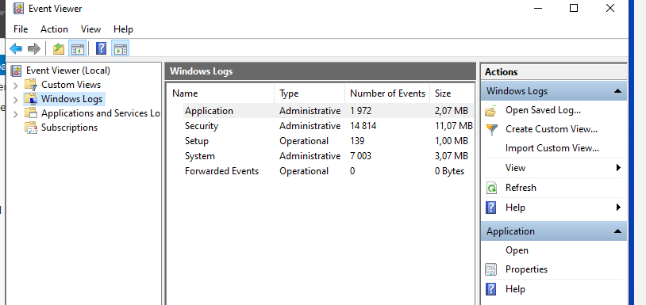
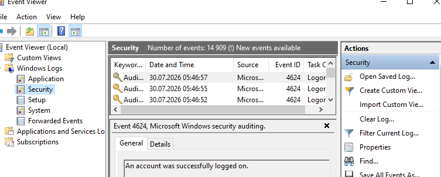
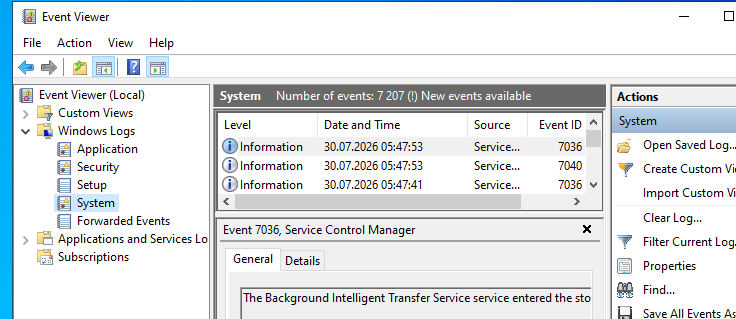
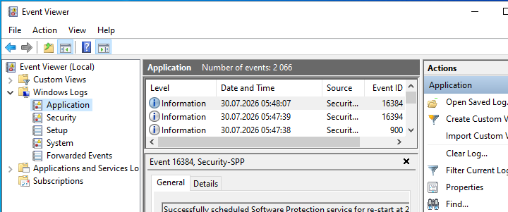
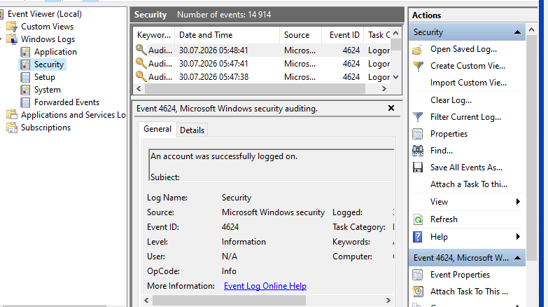
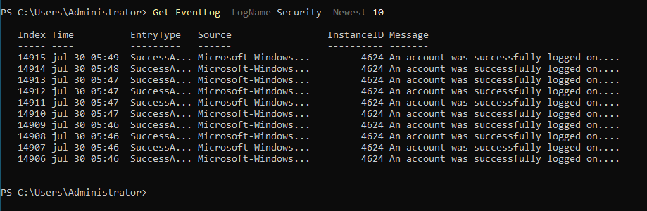
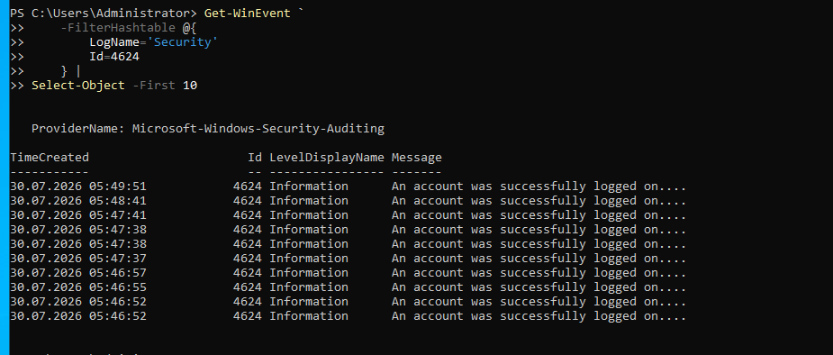
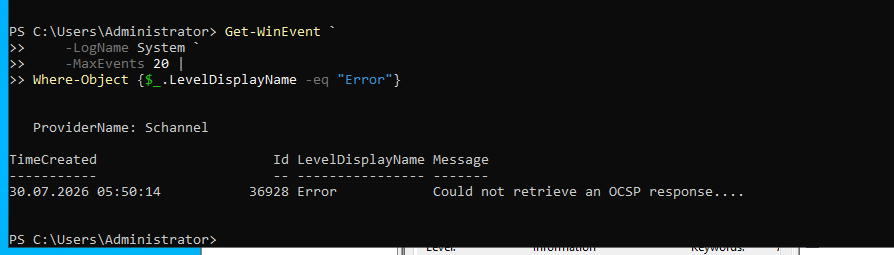
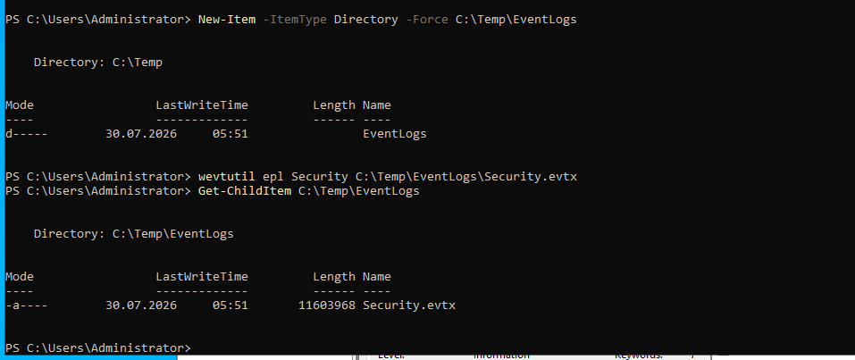

# Windows Event Logs and Monitoring

## Overview

This lab demonstrates how Windows Event Viewer and PowerShell can be used to monitor, investigate, and export Windows event logs.

The objective was to examine Windows Server logs, identify security-related events, filter specific Event IDs, retrieve logs using PowerShell, and export log data for later analysis.

---

## Environment

- Server: GT-DC01
- Operating System: Windows Server 2022 Standard Evaluation
- Domain: greentech.local
- Tools:
  - Event Viewer
  - Windows PowerShell
  - wevtutil

---

## Objectives

The objectives of this lab were to:

- Explore Windows Event Viewer
- Review Security, System, and Application logs
- Filter successful logon events
- Retrieve events using PowerShell
- Export Windows Event Logs
- Demonstrate basic Windows monitoring techniques

---

## Windows Event Viewer

The Windows Event Viewer console provides centralized logging for Windows services and applications.

The following logs were reviewed:

- Application
- Security
- Setup
- System
- Forwarded Events



---

## Security Log

The Security log records authentication, authorization, and auditing events.

Typical events include:

- Successful logons
- Failed logons
- Account lockouts
- Privilege usage
- Group membership changes

The Security log was reviewed using Event Viewer.



---

## System Log

The System log records operating system events generated by Windows components and services.

Examples include:

- Service starts
- Driver events
- System warnings
- Hardware events



---

## Application Log

The Application log stores events generated by installed software and Windows applications.

Examples include:

- IIS
- Windows Server Backup
- Applications
- Third-party software



---

## Filtering Event ID 4624

The Security log was filtered for Event ID **4624**, which represents successful user logons.

Filtering allows administrators to focus on specific security events during investigations.



---

## Retrieving Logs with PowerShell

Recent Security events were retrieved using:

```powershell
Get-EventLog -LogName Security -Newest 10
```



---

Successful logon events were retrieved using:

```powershell
Get-WinEvent -FilterHashtable @{
    LogName='Security'
    Id=4624
} | Select-Object -First 10
```



---

## System Error Investigation

Recent System log entries were filtered for errors.

```powershell
Get-WinEvent -LogName System -MaxEvents 20 |
Where-Object {$_.LevelDisplayName -eq "Error"}
```

This provides a quick method for identifying operational issues.



---

## Exporting Event Logs

The Security log was exported using:

```powershell
wevtutil epl Security C:\Temp\EventLogs\Security.evtx
```

The exported log can be archived or imported into another Windows system for analysis.



---

## Monitoring Benefits

Windows Event Logs help administrators:

- Detect authentication events
- Investigate incidents
- Troubleshoot services
- Verify system health
- Support forensic investigations
- Audit administrator activity

---

## Skills Demonstrated

- Windows Event Viewer
- Security log analysis
- System log analysis
- Application log analysis
- Event ID filtering
- PowerShell log retrieval
- Event log exporting
- Windows monitoring
- Basic incident investigation

---

## Outcome

A structured monitoring workflow was successfully implemented using Windows Event Viewer and PowerShell.

The lab demonstrated how Windows event logs can be filtered, queried, and exported to support administration, troubleshooting, and security investigations.