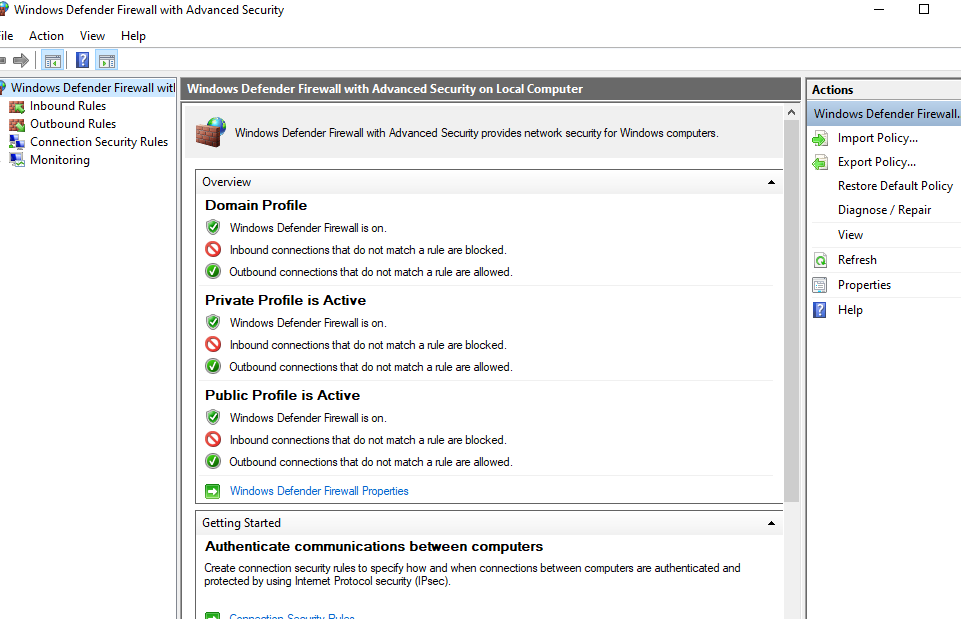
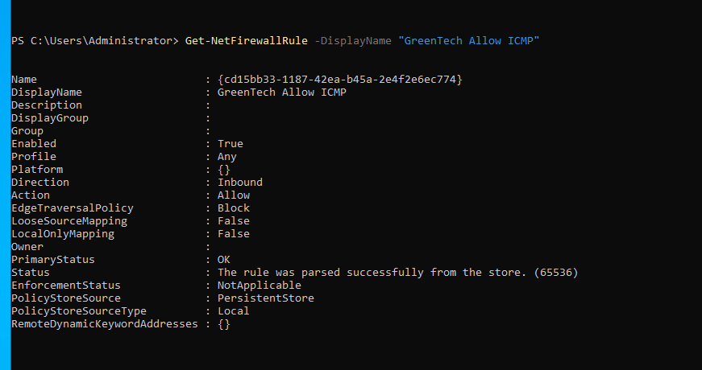
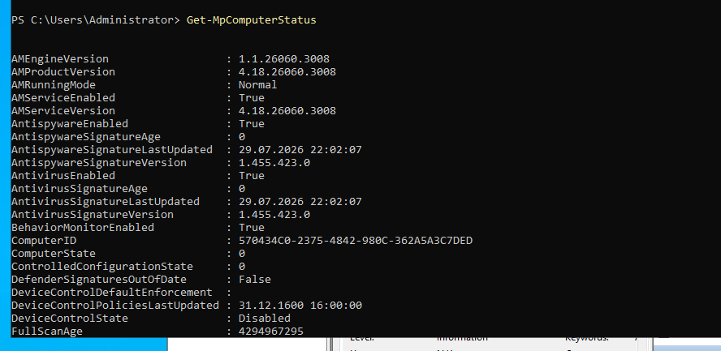
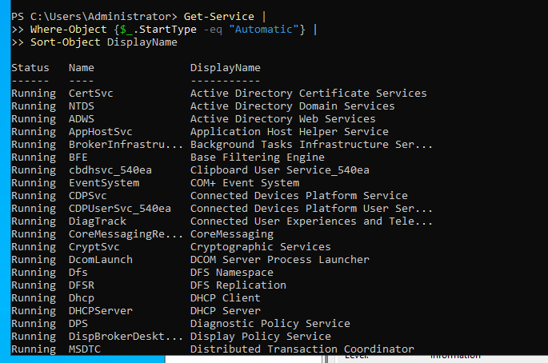
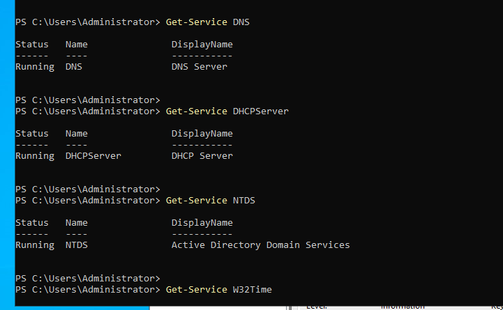
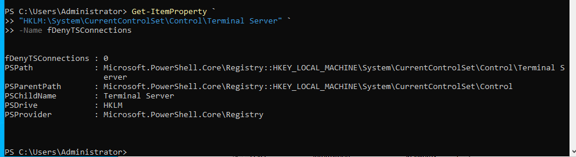
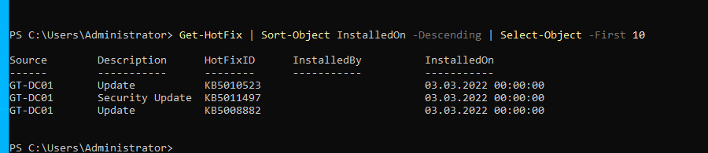

# Windows Server Hardening

## Overview

This lab demonstrates basic Windows Server hardening techniques used to improve the security posture of a Windows Server 2022 environment.

The objective was to review firewall settings, verify critical services, inspect Windows Defender status, review automatic services, validate Remote Desktop configuration, and verify installed Windows updates.

---

## Environment

- Server: GT-DC01
- Operating System: Windows Server 2022 Standard Evaluation
- Domain: greentech.local

---

## Objectives

- Review Windows Firewall configuration
- Verify firewall profiles
- Create a custom firewall rule
- Verify Microsoft Defender status
- Review automatically started services
- Validate critical Windows services
- Review Remote Desktop configuration
- Verify installed Windows updates

---

# Windows Firewall

Windows Defender Firewall provides host-based protection by filtering inbound and outbound network traffic.

The firewall profiles were reviewed to ensure they were enabled.


---

## Firewall Profiles

PowerShell was used to verify the Domain, Private, and Public firewall profiles.

```powershell
Get-NetFirewallProfile
```



---

## Custom Firewall Rule

A custom inbound firewall rule was created to allow ICMPv4 traffic for internal testing.

```powershell
New-NetFirewallRule `
-DisplayName "GreenTech Allow ICMP" `
-Direction Inbound `
-Protocol ICMPv4 `
-Action Allow
```

The rule was successfully verified.



---

## Microsoft Defender

The Windows Defender status was reviewed using PowerShell.

```powershell
Get-MpComputerStatus
```

This validates whether Defender Antivirus is available and operational.



---

## Automatic Services

Services configured to start automatically were reviewed.

```powershell
Get-Service |
Where-Object {$_.StartType -eq "Automatic"}
```

This helps identify services that are always running and supports security reviews.



---

## Critical Services

Several critical infrastructure services were verified.

- DNS
- DHCP Server
- Active Directory Domain Services
- Windows Time

```powershell
Get-Service DNS
Get-Service DHCPServer
Get-Service NTDS
Get-Service W32Time
```



---

## Remote Desktop Configuration

The Remote Desktop registry setting was reviewed.

```powershell
Get-ItemProperty `
"HKLM:\System\CurrentControlSet\Control\Terminal Server" `
-Name fDenyTSConnections
```

The configuration was documented without making any changes.



---

## Installed Windows Updates

Recently installed Windows updates were reviewed.

```powershell
Get-HotFix
```

Reviewing installed updates helps verify patch management and identify recently applied security fixes.



---

## Security Benefits

The hardening measures demonstrated in this lab help to:

- Reduce attack surface
- Verify firewall protection
- Validate antivirus availability
- Ensure critical infrastructure services are operational
- Review Remote Desktop exposure
- Verify Windows patch status
- Support operational security reviews

---

## Skills Demonstrated

- Windows Firewall Administration
- Firewall Rule Management
- PowerShell Administration
- Windows Service Management
- Microsoft Defender Administration
- Windows Patch Verification
- Remote Desktop Configuration Review
- Windows Server Hardening

---

## Outcome

The Windows Server environment was reviewed using several common hardening and verification techniques.

These activities demonstrate practical system administration skills commonly used to secure enterprise Windows Server environments.