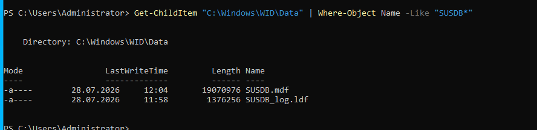
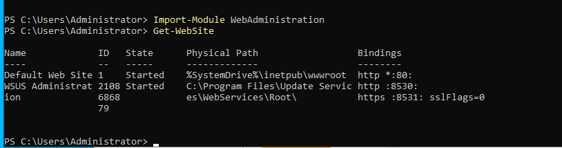
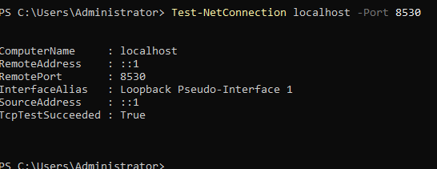
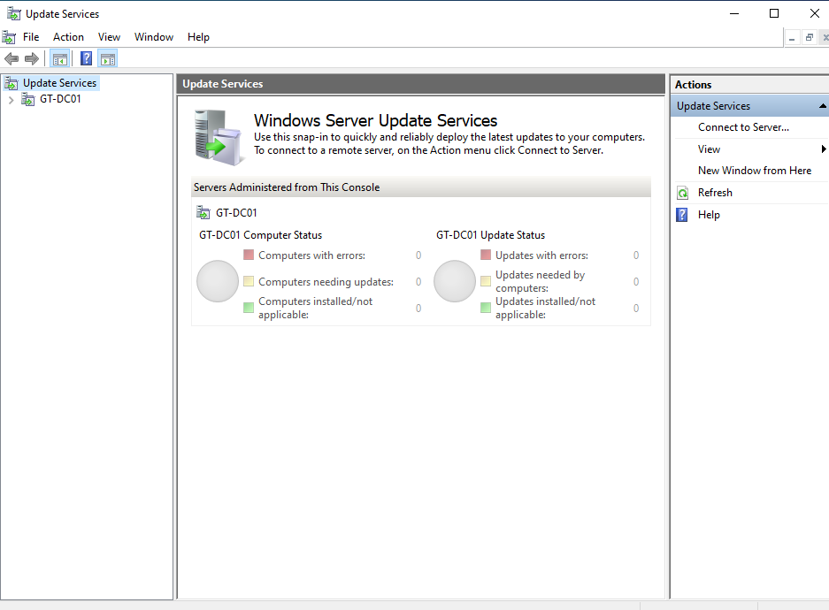

# Windows Server Update Services

## Overview

Windows Server Update Services was installed to demonstrate centralized Windows update management in the GreenTech lab environment.

WSUS allows administrators to control how Microsoft updates are distributed to managed Windows devices. It can be used to select products, classifications, approval rules, synchronization schedules, and computer groups.

The server used for this deployment was:

- Server: `GT-DC01`
- Domain: `greentech.local`
- WSUS content directory: `C:\WSUS`
- Database: Windows Internal Database
- HTTP port: `8530`
- HTTPS port: `8531`

---

## Role Installation

The WSUS server role and management tools were installed using PowerShell:

```powershell
Install-WindowsFeature UpdateServices -IncludeManagementTools
```

The installation completed successfully without requiring a restart.

---

## Content Directory

A dedicated directory was created for WSUS update content:

```powershell
New-Item -ItemType Directory -Path C:\WSUS -Force
```

The WSUS post-installation process was then started with:

```powershell
& "C:\Program Files\Update Services\Tools\WsusUtil.exe" postinstall CONTENT_DIR=C:\WSUS
```

---

## Troubleshooting and Database Recovery

During the initial post-installation process, WSUS reported a database schema version conflict.

The Windows Internal Database contained an incomplete or incompatible `SUSDB` database registration. The following troubleshooting steps were performed:

1. Windows performance counters were rebuilt.
2. WSUS was removed and reinstalled.
3. The old `SUSDB` database files were removed.
4. The orphaned database registration was removed from Windows Internal Database.
5. WSUS post-installation was run again.
6. A new `SUSDB` database was successfully created.

The database was validated using:

```powershell
Get-ChildItem "C:\Windows\WID\Data" | Where-Object Name -Like "SUSDB*"
```

The validation confirmed the presence of:

- `SUSDB.mdf`
- `SUSDB_log.ldf`

---

## Service Validation

The WSUS and IIS services were validated using:

```powershell
Get-Service WsusService,W3SVC
```

Both services were confirmed to be running:

- WSUS Service
- World Wide Web Publishing Service


---

## Database Validation

The Windows Internal Database was checked to confirm that the new WSUS database had been created successfully.

```powershell
Get-ChildItem "C:\Windows\WID\Data" | Where-Object Name -Like "SUSDB*"
```



---

## IIS Configuration

WSUS created a dedicated IIS website named:

```text
WSUS Administration
```

The website was configured with the standard WSUS ports:

- HTTP: `8530`
- HTTPS: `8531`

The IIS configuration was validated using:

```powershell
Import-Module WebAdministration
Get-WebSite
```



---

## Network Port Validation

The local WSUS HTTP port was tested using:

```powershell
Test-NetConnection localhost -Port 8530
```

The result confirmed:

```text
TcpTestSucceeded : True
```



---

## Management Console

The WSUS management console was opened using:

```powershell
Start-Process "$env:ProgramFiles\Update Services\AdministrationSnapin\wsus.msc"
```

The console provided access to:

- Updates
- Computers
- Synchronizations
- Reports
- Options



---

## Synchronization Limitation

The initial connection to Microsoft Update was attempted through the WSUS Configuration Wizard.

The VirtualBox server was configured with:

- 4 GB RAM
- 2 virtual CPU cores

During the first connection attempt, the virtual machine became unresponsive because of the resource demand associated with initial WSUS metadata processing and synchronization.

Because the primary goal of this lab was to demonstrate installation, service configuration, database initialization, IIS integration, and local connectivity, the full Microsoft Update synchronization was not completed.

The following WSUS components were successfully validated:

- WSUS role installation
- Windows Internal Database initialization
- WSUS content directory configuration
- IIS website creation
- WSUS service operation
- Port 8530 connectivity
- WSUS management console access

---

## Skills Demonstrated

- Windows Server role installation
- Windows Server Update Services
- Windows Internal Database
- IIS administration
- PowerShell administration
- Windows service validation
- Network port testing
- Database troubleshooting
- WSUS post-installation recovery
- Technical documentation

---

## Outcome

WSUS was successfully installed and locally validated in the GreenTech lab.

Although the first Microsoft Update synchronization could not be completed because of limited virtual machine resources, the WSUS infrastructure was functional and ready for further configuration in an environment with additional memory and processing capacity.